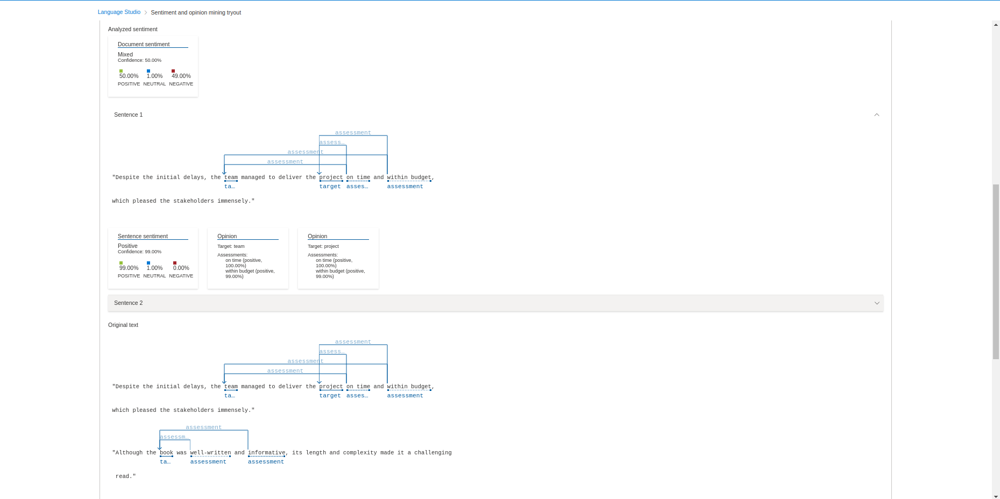

# Análise de Sentimento com Azure Language Studio

Este repositório demonstra a análise de sentimento usando o serviço de "Leitura" do Azure Language Studio.

## Frases de Entrada

As seguintes frases foram analisadas:
"Despite the initial delays, the team managed to deliver the project on time and within budget, which pleased the stakeholders immensely."

"Although the book was well-written and informative, its length and complexity made it a challenging read."





## Resultados da Análise

A tarefa retornou o seguinte JSON:

```json
{
    "documents": [
        {
            "id": "id__804",
            "sentiment": "mixed",
            "confidenceScores": {
                "positive": 0.5,
                "neutral": 0.01,
                "negative": 0.49
            },
            "sentences": [
                {
                    "sentiment": "positive",
                    "confidenceScores": {
                        "positive": 0.99,
                        "neutral": 0.01,
                        "negative": 0
                    },
                    "offset": 0,
                    "length": 139,
                    "text": "\"Despite the initial delays, the team managed to deliver the project on time and within budget, which pleased the stakeholders immensely.\" ",
                    "targets": [
                        {
                            "sentiment": "positive",
                            "confidenceScores": {
                                "positive": 1,
                                "negative": 0
                            },
                            "offset": 33,
                            "length": 4,
                            "text": "team",
                            "relations": [
                                {
                                    "relationType": "assessment",
                                    "ref": "#/documents/0/sentences/0/assessments/0"
                                },
                                {
                                    "relationType": "assessment",
                                    "ref": "#/documents/0/sentences/0/assessments/1"
                                }
                            ]
                        },
                        {
                            "sentiment": "positive",
                            "confidenceScores": {
                                "positive": 1,
                                "negative": 0
                            },
                            "offset": 61,
                            "length": 7,
                            "text": "project",
                            "relations": [
                                {
                                    "relationType": "assessment",
                                    "ref": "#/documents/0/sentences/0/assessments/0"
                                },
                                {
                                    "relationType": "assessment",
                                    "ref": "#/documents/0/sentences/0/assessments/1"
                                }
                            ]
                        }
                    ],
                    "assessments": [
                        {
                            "sentiment": "positive",
                            "confidenceScores": {
                                "positive": 1,
                                "negative": 0
                            },
                            "offset": 69,
                            "length": 7,
                            "text": "on time",
                            "isNegated": false
                        },
                        {
                            "sentiment": "positive",
                            "confidenceScores": {
                                "positive": 0.99,
                                "negative": 0.01
                            },
                            "offset": 81,
                            "length": 13,
                            "text": "within budget",
                            "isNegated": false
                        }
                    ]
                },
                {
                    "sentiment": "negative",
                    "confidenceScores": {
                        "positive": 0.01,
                        "neutral": 0,
                        "negative": 0.99
                    },
                    "offset": 139,
                    "length": 108,
                    "text": "\"Although the book was well-written and informative, its length and complexity made it a challenging read.\" ",
                    "targets": [
                        {
                            "sentiment": "positive",
                            "confidenceScores": {
                                "positive": 1,
                                "negative": 0
                            },
                            "offset": 153,
                            "length": 4,
                            "text": "book",
                            "relations": [
                                {
                                    "relationType": "assessment",
                                    "ref": "#/documents/0/sentences/1/assessments/0"
                                },
                                {
                                    "relationType": "assessment",
                                    "ref": "#/documents/0/sentences/1/assessments/1"
                                }
                            ]
                        }
                    ],
                    "assessments": [
                        {
                            "sentiment": "positive",
                            "confidenceScores": {
                                "positive": 1,
                                "negative": 0
                            },
                            "offset": 162,
                            "length": 12,
                            "text": "well-written",
                            "isNegated": false
                        },
                        {
                            "sentiment": "positive",
                            "confidenceScores": {
                                "positive": 1,
                                "negative": 0
                            },
                            "offset": 179,
                            "length": 11,
                            "text": "informative",
                            "isNegated": false
                        }
                    ]
                }
            ],
            "warnings": []
        }
    ],
    "errors": [],
    "modelVersion": "2024-03-01"
}
```

## Com base nisso, podemos observar:

Frase 1: "Despite the initial delays, the team managed to deliver the project on time and within budget, which pleased the stakeholders immensely."

Sentimento geral da frase: Positivo (confiança de 99%).
Sentimento geral do documento: Misto (confiança de 50% positivo, 49% negativo). Isso ocorre porque a análise de sentimento no nível do documento leva em conta todas as frases, e a segunda frase tem sentimento negativo.

Alvos e Avaliações:
Alvo: "team" (sentimento positivo, confiança de 100%).
Alvo: "project" (sentimento positivo, confiança de 100%).
Avaliação: "on time" (sentimento positivo, confiança de 100%).
Avaliação: "within budget" (sentimento positivo, confiança de 99%).
Frase 2: "Although the book was well-written and informative, its length and complexity made it a challenging read."

Sentimento geral da frase: Negativo (confiança de 99%).
Alvos e Avaliações:
Alvo: "book" (sentimento positivo, confiança de 100%).
Avaliação: "well-written" (sentimento positivo, confiança de 100%).
Avaliação: "informative" (sentimento positivo, confiança de 100%). Note que, apesar das avaliações serem positivas, o contexto geral da frase é negativo devido à "length and complexity".

## Insights
O Azure Language Studio consegue identificar sentimentos positivos e negativos em frases, mesmo com concessões (uso de "Despite" e "Although").
A análise no nível da frase pode diferir da análise no nível do documento, pois considera o contexto geral.
A identificação de alvos e avaliações permite uma análise mais granular do sentimento.
Possibilidades
Monitoramento de mídias sociais para entender a opinião pública sobre um produto ou serviço.
Análise de feedback de clientes para identificar áreas de melhoria.
Classificação de avaliações de produtos.